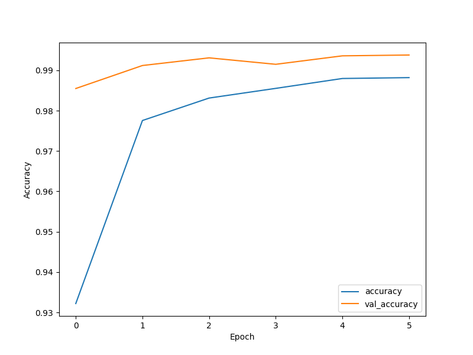
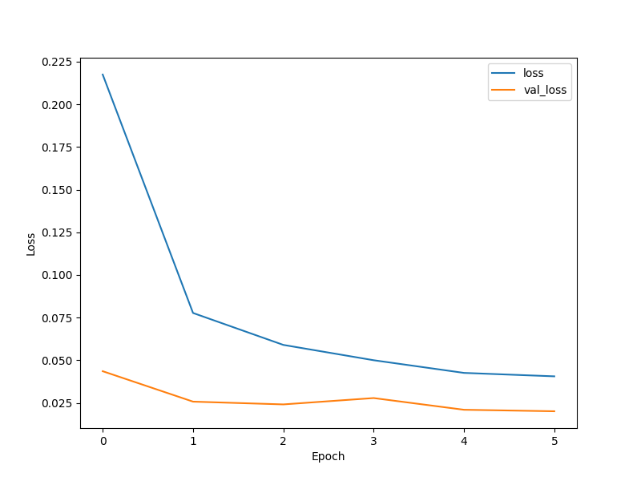

In this part I will make an AI that is able to recognize handwritten digits of size 32 x 32 pixels.
This AI will be based on the CNN model.
I will use Python libraries : NumPy, TensorFlow, Keras and matplotlib.
The accuracy of the model is about 98.65%.
## Graphs representing CNN model accuracy and loss

